<div align="center">



<br>


</div>

<br>

## 🕵️ About Me

```yaml
name:      Kito
role:      CyberSecurity Student
focus:     Offensive Security / Pentesting
mindset:   "Sistemleri anlamanın en iyi yolu onları kırmaktır."
```

I'm a **CyberSecurity student** sharpening my skills in offensive security — recon, exploitation, and reporting. I like building my own tooling instead of just relying on off-the-shelf scanners.

---

## 🔭 What I'm Working On

- 🔎 Building subdomain enumeration & attack-surface recon tools
- 🛡️ Writing automated vulnerability scanners based on OWASP checks
- 📝 Solving machines/challenges on **Hack The Box** and documenting write-ups

## 🌱 Currently Learning

> Active Directory pentesting · Advanced Burp Suite usage · Tool development in Go

---

## 🛠️ Tools & Technologies

<div align="center">


</div>

---

## 📌 Featured Projects

- 🔍 **[subdomain-recon-tool](https://github.com/Vorlixx/subdomain-recon-tool)** — crt.sh passive enum + DNS brute-force + port scanning + fingerprinting, JSON/HTML reporting
- 🛡️ **[vuln_scanner](https://github.com/Vorlixx/vuln_scanner)** — HTTP security headers, TCP port scanning, OWASP checks, PDF reporting
- 📝 **[HTB-Chaogen-Writeup](https://github.com/Vorlixx/HTB-Chaogen-Writeup)** — Hack The Box write-up and automated solver

---

## 📊 GitHub Stats

<div align="center">


<br>


</div>

> Grafikler yüklenmezse: bunlar canlı, dış servislerden (vercel/demolab) beslenen görüntülerdir; GitHub sayfayı yenilediğinde (Ctrl+Shift+R) veya birkaç saniye sonra normalde gelirler.

---

## 📫 Reach Me

<div align="center">

[](https://discord.com/users/1223684489423618084)
[](mailto:kito.00283@gmail.com)

**Discord:** `vorlixx_83` &nbsp;•&nbsp; **Email:** kito.00283@gmail.com

</div>

<div align="center">
<sub>⚡ built for breaking things, not just reading about them ⚡</sub>
</div>
