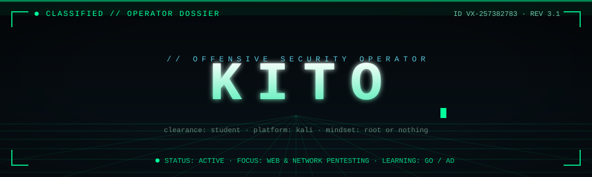
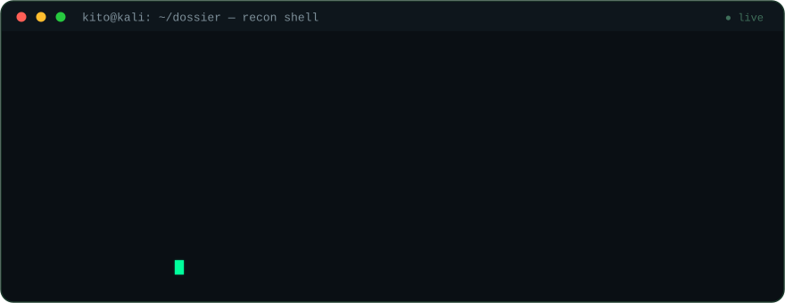
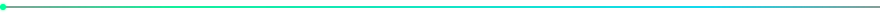
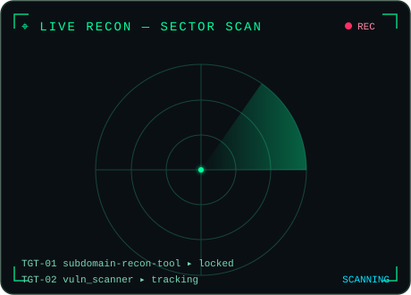
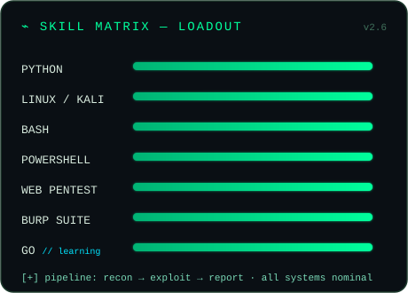
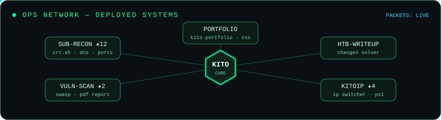

<div align="center">



<br>

<a href="https://github.com/Vorlixx?tab=followers"></a>

<a href="https://github.com/Vorlixx/kito-portfolio"></a>

<br><br>



</div>

<div align="center">

</div>

<div align="center">
<table width="100%"><tr>
<td width="49.7%" align="center"></td>
<td width="49.7%" align="center"></td>
</tr></table>
</div>

> *"Sistemleri anlamanın en iyi yolu onları kırmaktır."* — **kito**

<div align="center">

## ⌖ CURRENT OPERATIONS

```text
▸ building  ·  subdomain enum & attack-surface recon tooling
▸ writing   ·  automated vulnerability scanners (OWASP → PDF)
▸ grinding  ·  hackthebox machines + write-ups
▸ learning  ·  AD pentesting · burp suite mastery · go
```

</div>

<div align="center">

</div>

<div align="center">

</div>

<div align="center">

| ⬢ system | ⌖ role | ⚡ signal |
|---|---|---|
| **[subdomain-recon-tool](https://github.com/Vorlixx/subdomain-recon-tool)** | recon framework — crt.sh passive · DNS brute · ports · fingerprinting |  |
| **[vuln_scanner](https://github.com/Vorlixx/vuln_scanner)** | HTTP security headers · TCP scan · OWASP checks · PDF report |  |
| **[KitoIP](https://github.com/Vorlixx/KitoIP)** | one terminal, three ways to change your IP — proxy · LAN · WARP |  |
| **[HTB-Chaogen-Writeup](https://github.com/Vorlixx/HTB-Chaogen-Writeup)** | HTB medium coding — automated solver + write-up |  |
| **[kito-portfolio](https://github.com/Vorlixx/kito-portfolio)** | offensive-security portfolio site |  |

</div>

<div align="center">

</div>

<div align="center">


<br>


<br>


</div>

<div align="center">

</div>

<div align="center">

### ⬢ CONTRIBUTION GRID — LIVE FEED

<picture>
  <source media="(prefers-color-scheme: dark)" srcset="https://raw.githubusercontent.com/Vorlixx/Vorlixx/output/github-contribution-grid-snake.svg"/>
  
</picture>


</div>
